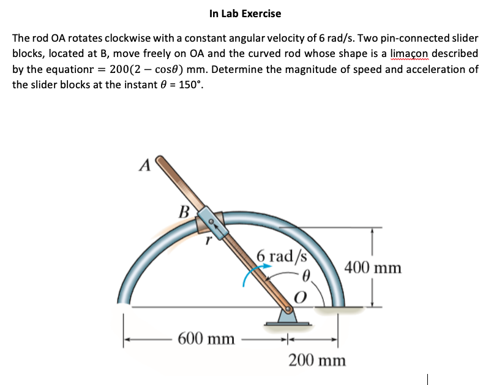

## Problem


$$
r=200(2-\cos \theta) \\
$$

## Solution 

1. Polar and cylindrical coordinates

<iframe width="100%" height="800px" src="https://jinsanity07git.github.io/UWMnotebook/#/CE202/Dynamics?id=chapter-12-sections-7-8"></iframe>

2. Velocity. Using the chain rule, the first and second time derivatives of r can be determined.

$$
\begin{array}
{l}r=200(2-\cos \theta) \\ 

\dot{r}=200(\sin \theta) \dot{\theta}=\{200(\sin \theta) \dot{\theta}\} \mathrm{mm} / \mathrm{s} \\ 

\ddot{r}=\left\{200\left[(\cos \theta) \dot{\theta}^{2}+(\sin \theta) \ddot{\theta}\right]\right\} \mathrm{mm} / \mathrm{s}^{2}

\end{array}
$$

3. The radial and transverse components of the velocity are

$$
\begin{array}{l}v_{r}=\dot{r}=\{200(\sin \theta) \dot{\theta}\} 
\mathrm{mm} / \mathrm{s} \\

v_{\theta}=r \dot{\theta}=\{200(2-\cos \theta) \dot{\theta}\} 
\mathrm{mm} / \mathrm{s}\end{array}
$$

$$
\begin{array}
{l}\text { Since } \theta \text { is in the opposite sense to that of positive } \theta, \theta=-6 \mathrm{rad} / \mathrm{s} . \text { Thus, at } \theta=150^{\circ} \\ 

\qquad
\end{array}
$$

$$
\begin{array}
{l}v_{r}=200\left(\sin 150^{\circ}\right)(-6)=-600
\mathrm{~mm} / \mathrm{s} \\ 

v_{\theta}=200\left(2-\cos 150^{\circ}\right)(-6)=-3439.23 \mathrm{~mm} / \mathrm{s}

\end{array}
$$

Thus, the magnitude of the velocity is
$$
v=\sqrt{v_{r}^{2}+v_{\theta}^{2}}
$$

## Numerical test

[limacon generator](https://echarts.apache.org/examples/en/editor.html?c=line-polar)    

```python
var data = [];

for (var i = 0; i <= 100; i++) {
    var theta = i / 100 * 360;
    var r = 200 * (2 - Math.cos(theta / 180 * Math.PI));
    data.push([r, theta]);
}


option = {
    title: {
        text: 'Polar and cylindrical coordinates '
    },
    legend: {
        data: ['line']
    },
    polar: {},
    tooltip: {
        trigger: 'axis',
        axisPointer: {
            type: 'cross'
        }
    },
    angleAxis: {
        type: 'value',
        startAngle: 0
    },
    radiusAxis: {
    },
    series: [{
        coordinateSystem: 'polar',
        name: 'line',
        type: 'line',
        data: data
    }]
};
```


### Let $\dot\theta$= $6$ mm/s  and  $\theta$= $- 150^o$ 

<iframe width="100%" height="800px" src="CE202/lab/numerical/polar_vt_6_theta-150.html"></iframe>

### Let $\dot\theta$= $-6$ mm/s  and  $\theta$= $ 150^o$ 

<iframe width="100%" height="800px" src="CE202/lab/numerical/polar_vt_-6_theta150.html"></iframe>

### Let $\dot\theta$= $-6$ mm/s  and  $\theta$= $ -150^o$ 

<iframe width="100%" height="800px" src="CE202/lab/numerical/polar_vt_-6_theta-150.html"></iframe>

### Let $\dot\theta$= $6$ mm/s  and  $\theta$= $ 150^o$ 

<iframe width="100%" height="800px" src="CE202/lab/numerical/polar_vt_6_theta150.html"></iframe>


